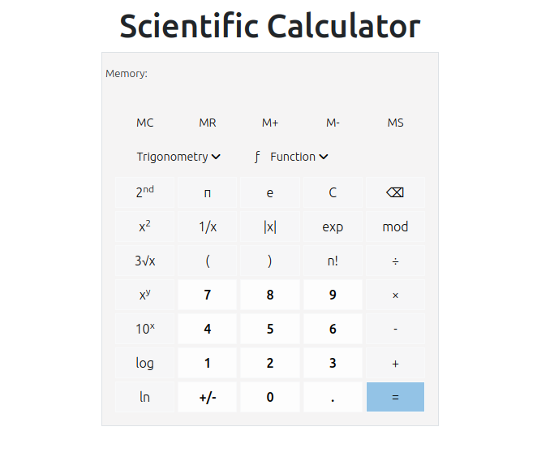

# Javascript_Practical

A web-based scientific calculator using Javascript, HTML and CSS - bootstrap.

UI of the calculator:

The calculator performs below mentioned operations currently:
+, -, /, \*, mod, x^2, 1/x, 2√x, π, e, log, ln, M+, M-, MC ,MR and MS
